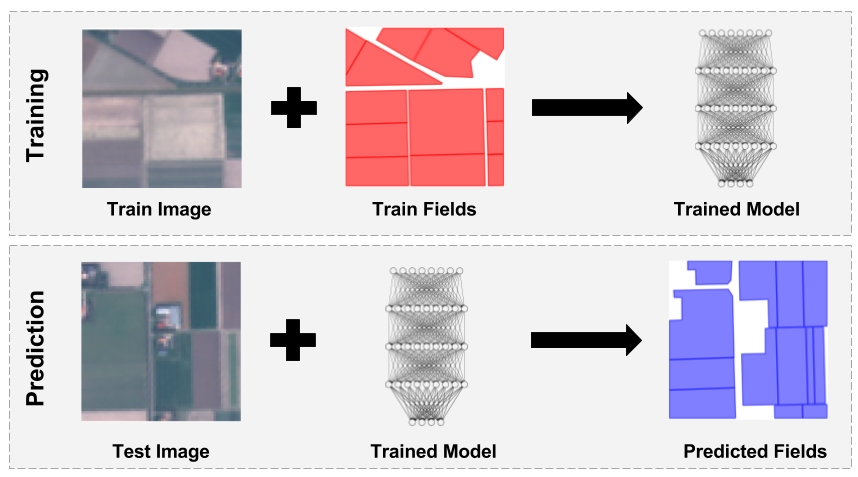

# InstanceSegmentation_Sentinel2  

**Deep Learning for Instance Segmentation of Agricultural Fields - Master thesis (work in progress)**  
     

     
**Motivation & Aims**  
Geospatial data of agricultural field boundaries and segments is essential for crop type and yield monitoring, forecasting, precision farming and subsidy management etc. Their manual delineation from satellite images is accurate but time consuming, and many automatic approaches using traditional image segmentation techniques struggle with the fields' physical variety.  
Deep Learning, a new concept of Machine Learning algorithms, has enabled major advancements for various computer vision tasks, but hasn’t yet reached mainstream adoption for remote sensing applications. In this work, the potential of Deep Learning Instance Segmentation for the delineation and classification of agricultural fields from satellite images is explored. A Fully Convolutional Neural Network architecture, adapted from Li et al. (2016), is trained and evaluated on image chips of cloud-free Sentinel-2 data and georeferenced polygons of agricultural fields from the 2016 Netherland’s Basis Registration Parcels (BRP) dataset. Furthermore, the work introduces the basics of Deep Learning for Computer Vision, Neural Networks, Convolutional and Fully Convolutional Neural Networks. It also describes the evolution and current state of the art of Instance Segmentation models and explores the advantages and challenges of applying Deep Learning Instance Segmentation to remote sensing imagery.                   
      
