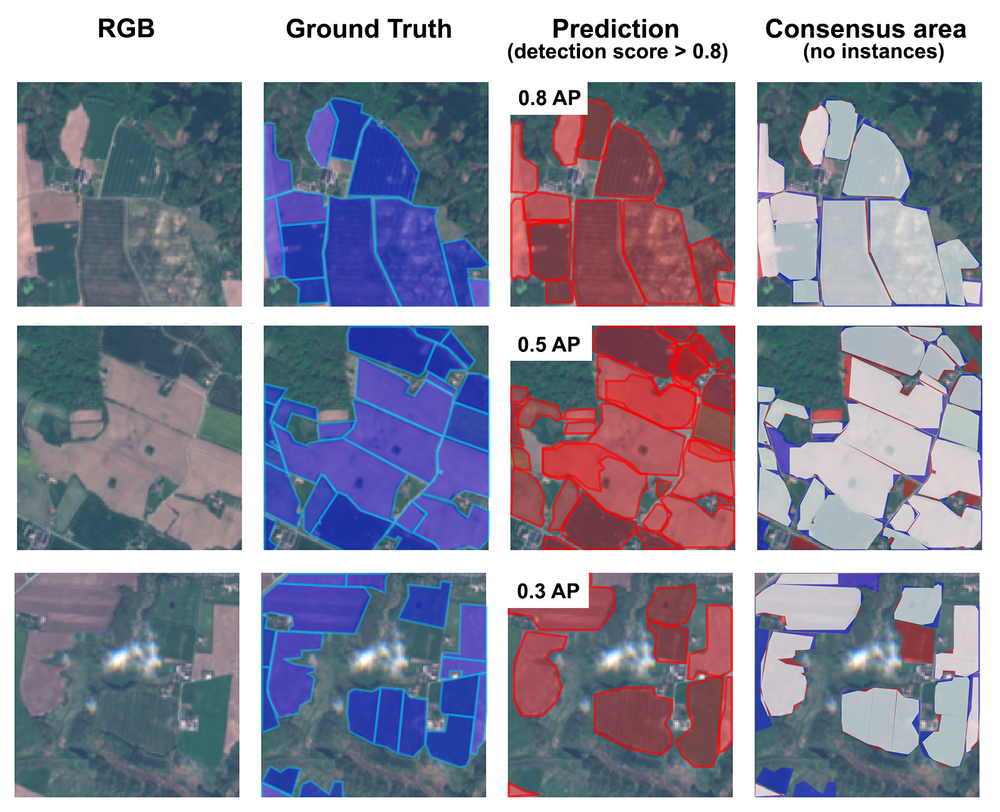
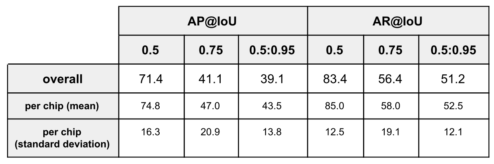

# Deep Learning for Instance Segmentation of Agricultural Fields - Master thesis

<p align="center">
  
</p>

## Abstract
This thesis aims to delineate agricultural field parcels from satellite images via deep learning 
instance segmentation. Manual delineation is accurate but time consuming, and many 
automated approaches with traditional image segmentation techniques struggle to capture 
the variety of possible field appearances. Deep learning has proven to be successful in 
various computer vision tasks, and might be a good candidate to enable accurate, 
performant and generalizable delineation of agricultural fields. Here, a fully convolutional 
instance segmentation architecture (adapted from Li et al., 2016), was trained on Sentinel-2 
image data and corresponding agricultural field polygons from Denmark. In contrast to many 
other approaches, the model operates on raw RGB images without significant pre- and 
post-processing. After training, the model proved successful in predicting field boundaries on 
held-out image chips. The results generalize across different field sizes, shapes and other 
properties, but show characteristic problems in some cases. In a second experiment, the 
model was trained to simultaneously predict the crop type of the field instance. Performance 
in this setting was significantly worse. Many fields were correctly delineated, but the wrong 
crop class was predicted. Overall, the results are promising and prove the validity of the deep 
learning approach. Also, the methodology offers many directions for future improvement.

<p align="center">
  
</p>

## Results

<p align="center">
  
</p>
<p align="center">
  
</p>

## Instructions
    
### 1. Installation FCIS & MXNet
Install the FCIS model and MXNet framework according to the instructions in the [FCIS repository](https://github.com/msracver/FCIS). The setup works well with an AWS EC2 P2 instance and the official AWS Deep Learning AMI (Ubuntu). Make sure that the installations were successfull by running the FCIS demo:

```shell 
> python FCIS/fcis/demo.py
```

### 2. Data Preprocessing
Follow the instructions and run the code in the [Preprocessing Jupyter notebook](https://github.com/chrieke/InstanceSegmentation_Sentinel2/blob/master/preprocessing.ipynb). This will prepare the Denmark LPIS field data and create the image chips and COCO format annotations. When finished, place the preprocessed vector folder `.output/preprocessing/annotations` and image folder `.output/preprocessing/images` in `.FCIS/data/coco`.

<p align="center">
  
</p>
     
### 3. Configuration
Place the configuration file `.model/resnet_v1_101_coco_fcis_end2end_ohem.yaml` in `.FCIS/experiments/fcis/cfgs`. A more detailed description of the model and training parameters used for the thesis is given in thesis chapter 3.3. Then delete the annotations cache (neccessary each time you change a configuration parameter that could influence the model evaluation or training):

```shell 
> rm -rf .FCIS/data/coco/annotations_cache/; rm -rf .FCIS/data/cache/COCOMask/  
```
    
### 4. Model Evaluation   
Runs the prediction/model evaluation task via the model trained in the thesis. First move the folder containing the model `.model/resnet_v1_101_coco_fcis_end2end_ohem` to `FCIS/output/fcis/coco/resnet_v1_101_coco_fcis_end2end_ohem`. Then run the evaluation:

```shell 
> python experiments/fcis/fcis_end2end_test.py --cfg experiments/fcis/cfgs/resnet_v1_101_coco_fcis_end2end_ohem.yaml --ignore_cache
```

The resulting instance segmentation and object detection proposals will be saved to `FCIS/output/fcis/coco/resnet_v1_101_coco_fcis_end2end_ohem/val2016/detections_val2016_results.json`.   
    
### 5. Custom Model Training 
You can carry out your own model training with custom configurations or datasets. 
    
First adjust the *PIXEL_MEANS* values in the configuration file to the RGB channels means of your dataset (The band means are saved to `.output/preprocessed/statistics.json` during the preprocessing).    
   
Delete existing model files:

```shell 
> rm -rf /home/ubuntu/FCIS/output/fcis/coco/resnet_v1_101_coco_fcis_end2end_ohem/
```

Finally, run the training task:     

```shell 
> python experiments/fcis/fcis_end2end_train_test.py --cfg experiments/fcis/cfgs/resnet_v1_101_coco_fcis_end2end_ohem.yaml
```

